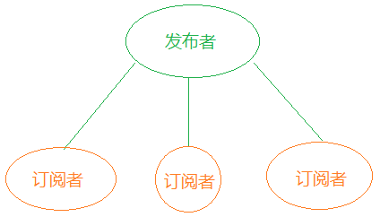

之前在看[DMQ](https://github.com/DMQ)根据[vue](https://cn.vuejs.org/)双向数据绑定原理模拟实现了[mvvm](https://github.com/DMQ/mvvm)，里面有提到发布者-订阅者模式，看了一些资料，今天自己简单实现了一个发布-订阅模式。
######何为发布-订阅模式？
>其定义对象间一种一对多的依赖关系，当一个对象的状态发生改变时，所有依赖于它的对象都将得到通知。 
>


首次接触这个概念的时候，会有几个疑问，对象？指DOM对象还是自定义对象，还是两者均可？依赖如何建立的？一个对象状态的改变如何影响所有依赖它的对象？
这里面以微信公众号为例，展开说明：
- 假如用户A订阅了 某一个公众号G，那么当公众号G推送消息的时候，用户A就会收到相关的推送，点开可以查看推送的消息内容。
- 但是公众号G并不关心订阅的它的是男人、女人还是二哈，它只负责发布自己的主体，只要是订阅公众号的用户均会收到该消息。
- 作为用户A，不需要时刻打开手机查看公众号G是否有推动消息，因为在公众号推送消息的那一刻，用户A就会收到相关推送。
- 当然了，用户A如果不想继续关注公众号G，那么可以取消关注，取关以后，公众号G再推送消息，A就无法收到了。
######发布-订阅模式抽象化
现在需要代码来实现订阅、发布、取消订单的功能
```javascript
        // 01-定义一个发布-订阅模式函数；
        function Pub2Sub() {
            // 02-订阅器；
            this._observer = {}
        }
        // 03-原型对象上面添加方法；
        Pub2Sub.prototype = {
            constructor: Pub2Sub,
            // 04-订阅者；
            subscribe,
            // 05-发布者；
            publish,
            // 06-取消订阅
            unsubscrible
        }
        // 实例化发布-订阅模式
        let ps = new Pub2Sub()

        // 添加订阅
        let sub1 = function (data) {
            console.log('sub1' + data)
        }
        let sub2 = function (data) {
            console.log('sub2' + data)
        }
        ps.subscribe('click', sub1)
        ps.subscribe('click', sub2)

        // 实现发布、取订及再发布
        ps.publish('click', '第一次点击消息').unsubscrible('click', sub2).publish('click', '第二次点击消息')
        // 打印结果依次是：
        // sub1第一次点击消息
        // sub2第一次点击消息
        // sub1第二次点击消息
```

**但是**，上述实现的代码存在两个问题：
- 如果直接发布，且主体不存在的话，会抛出异常，需要实现发布之后的订阅者查看历史发布记录
- 其次，上述功能的实现是通过定义在一个自定义对象，这样就与发布-订阅模式的松散耦合理念有些出入，所以还需要做到如何更优雅的管理接口。

######发布-订阅模式优化版
针对上述的问题，我在这个版本里面做了优化，看代码：
```javascript  
// 声明一个全局发布-订阅对象，为不同模块之间的可能存在的通信做铺垫
const Observer = (function () {
            // 订阅器
            const _observer = {}
            // 历史记录
            const _cache = {},
            // 订阅
            const subscribe = function (type, callback) {
            }
            // 发布
            const publish = function () {
            }
            // 取订
            const unsubscrible = function (type, callback) {
            }
            // 查看发布记录
            const viewLog = function (type, callback) {
            }
            return {
                _observer,
                _cache,
                subscribe,
                publish,
                unsubscrible,
                viewLog
            }
        }())
```
######理解对象间一对多的依赖关系
回到最初我们的问题，这个对象指的是既可以是自定义对象也可以是DOM对象
- 定义两个模块
```javascript
  let moduleA = {
          // 伪代码
          todo() {
            Observer.subscribe(type, function (data) {
                // 拿到 data 然后做一些事情
            })
        }
    }
  let moduleB = {
          // 伪代码
          todo() {
            Observer.subscribe(type, function (data) {
                // 拿到 data 然后做一些事情
            })
        }
    }
  // 下面是异步获取到数据
 // 伪代码
  ajax(function (data) {
        // 发布数据，所有的订阅均会拿到 data，然后按照自己的逻辑处理
        Observer.publish(type, data)
    })
```
可能会有人疑问，为什么需要这样来传递数据，直接在 `moduleA` 和 `moduleB` 里面直接获取数据不可以吗?
答案肯定是可以的，但是发布-订阅这种模式可以更优雅地在不同模块之间传递数据，代替传统的回调函数。

